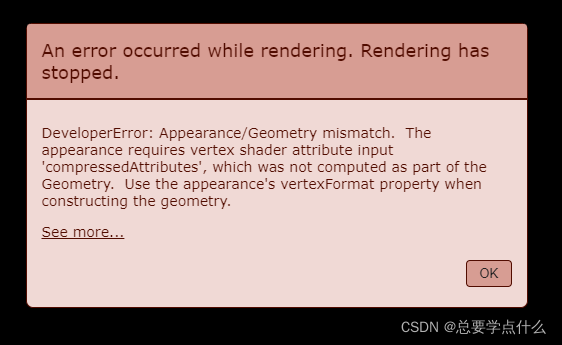

Cesium 在用 Primitive 创建对象时报错：Appearance/Geometry mismatch

```
An error occurred while rendering.  Rendering has stopped.
DeveloperError: Appearance/Geometry mismatch.  The appearance requires vertex shader attribute input 'color', which was not computed as part of the Geometry.  Use the appearance's vertexFormat property when constructing the geometry.
```



错误的大致意思就是实体的顶点和材质不匹配，导致渲染出错；

解决方案：

① 类似 BoxOutlineGeometry 这类几何，不能使用光照，需要将 appearance 中的 flat 属性设置为 true，即关闭光照。

正常代码：

```js
// 创建boxOutline的几何实例
let boxOutlineInstance = new Cesium.GeometryInstance({
  geometry: boxOutlineGeometry,
  modelMatrix: Cesium.Matrix4.multiplyByTranslation(
    Cesium.Transforms.eastNorthUpToFixedFrame(
      Cesium.Cartesian3.fromDegrees(120, 40)
    ),
    new Cesium.Cartesian3(0.0, 0.0, 1000.0),
    new Cesium.Matrix4()
  ),
  id: "boxOutline",
  attributes: {
    color: Cesium.ColorGeometryInstanceAttribute.fromColor(Cesium.Color.RED),
  },
});
// 创建图元
let primitive = new Cesium.Primitive({
  geometryInstances: boxOutlineInstance,
  appearance: new Cesium.PerInstanceColorAppearance({
    flat: true,
    faceForward: true,
    translucent: false,
    closed: false,
  }),
  show: true,
  modelMatrix: Cesium.Matrix4.IDENTITY,
  vertexCacheOptimize: false,
  interleave: false,
  compressVertices: true,
  releaseGeometryInstances: true,
  allowPicking: true,
  cull: true,
  asynchronous: true,
  debugShowBoundingVolume: false,
  shadows: Cesium.ShadowMode.DISABLED,
});
viewer.scene.primitives.add(primitive);
```

② 绘制 Primitive 实体时，几何图形的 vertexFormat 确定它是否可以与其他几何图形组合。两个几何图形不必是相同的类型，但它们需要匹配的顶点格式。我们可以理解成实体的 vertexFormat 需要与他的 appearance 定义的材质形式一致。

错误代码：

```js
let primitive = new Cesium.Primitive({
  geometryInstances: new Cesium.GeometryInstance({
    geometry: new Cesium.PolylineGeometry({
      positions: Cesium.Cartesian3.fromDegreesArray(positions),
      width: 3.0,
      vertexFormat: Cesium.PolylineColorAppearance.VERTEX_FORMAT,
    }),
  }),
  appearance: new Cesium.PolylineMaterialAppearance({
    flat: true,
    material: Cesium.Material.fromType(Cesium.Material.PolylineDashType, {
      color: Cesium.Color.CYAN, //线条颜色
      gapColor: Cesium.Color.TRANSPARENT, //间隔颜色
      dashLength: 20, //短划线长度
    }),
  }),
});
viewer.scene.primitives.add(primitive);
```

正确代码：注意 vertexFormat 形式更改为 PolylineMaterialAppearance

```js
let primitive = new Cesium.Primitive({
  geometryInstances: new Cesium.GeometryInstance({
    geometry: new Cesium.PolylineGeometry({
      positions: Cesium.Cartesian3.fromDegreesArray(positions),
      width: 3.0,
      vertexFormat: Cesium.PolylineMaterialAppearance.VERTEX_FORMAT,
    }),
  }),
  appearance: new Cesium.PolylineMaterialAppearance({
    material: Cesium.Material.fromType(Cesium.Material.PolylineDashType, {
      color: Cesium.Color.CYAN, //线条颜色
      gapColor: Cesium.Color.TRANSPARENT, //间隔颜色
      dashLength: 20, //短划线长度
    }),
  }),
});
viewer.scene.primitives.add(primitive);
```

https://blog.csdn.net/qq_34205305/article/details/123111058
