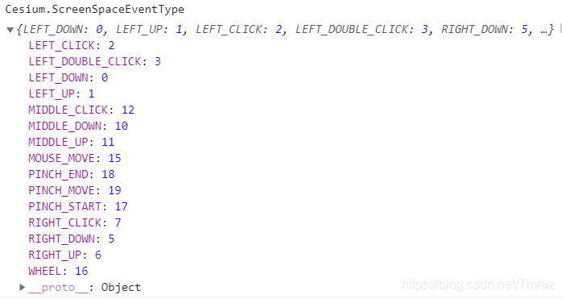

### 屏幕空间事件类型



| 名称                                          | 描述                             |
| :-------------------------------------------- | :------------------------------- |
| Cesium.ScreenSpaceEventType.LEFT_CLICK        | 鼠标左击事件                     |
| Cesium.ScreenSpaceEventType.LEFT_DOUBLE_CLICK | 鼠标左键双击事件                 |
| Cesium.ScreenSpaceEventType.LEFT_DOWN         | 左键鼠标按下事件                 |
| Cesium.ScreenSpaceEventType.LEFT_UP           | 左键鼠标抬起事件                 |
| Cesium.ScreenSpaceEventType.MIDDLE_CLICK      | 中键单机                         |
| Cesium.ScreenSpaceEventType.MIDDLE_DOWN       | 中键按下                         |
| Cesium.ScreenSpaceEventType.MIDDLE_UP         | 中键抬起                         |
| Cesium.ScreenSpaceEventType.MOUSE_MOVE        | 鼠标移动                         |
| Cesium.ScreenSpaceEventType.PINCH_END         | 表示两指事件在触摸面上的结束     |
| Cesium.ScreenSpaceEventType.PINCH_MOVE        | 两指移动                         |
| Cesium.ScreenSpaceEventType.PINCH_START       | 表示在触摸面上发生两指事件的开始 |
| Cesium.ScreenSpaceEventType.RIGHT_CLICK       | 鼠标右击事件                     |
| Cesium.ScreenSpaceEventType.RIGHT_DOWN        | 鼠标右键按下                     |
| Cesium.ScreenSpaceEventType.RIGHT_UP          | 鼠标右键抬起                     |
| Cesium.ScreenSpaceEventType.WHEEL             | 鼠标滚轮事件                     |

### 键盘修饰符类型

| 名称  | 描述                  |
| :---- | :-------------------- |
| SHIFT | 表示 shift 键被按住。 |
| CTRL  | 表示 ctrl 键被按住    |
| ALT   | 表示 alt 键被按住。   |

### 示例
```js
// 绑定屏幕空间事件
let handler = new Cesium.ScreenSpaceEventHandler(viewer.scene.canvas);
handler.setInputAction(
  function (event) {
    console.log("shift + 左键单击", event.position);
  },
  Cesium.ScreenSpaceEventType.LEFT_CLICK,
  Cesium.KeyboardEventModifier.SHIFT
);
// 移除屏幕空间事件
handler.removeInputAction(
  Cesium.ScreenSpaceEventType.LEFT_CLICK,
  Cesium.KeyboardEventModifier.SHIFT
);
```
